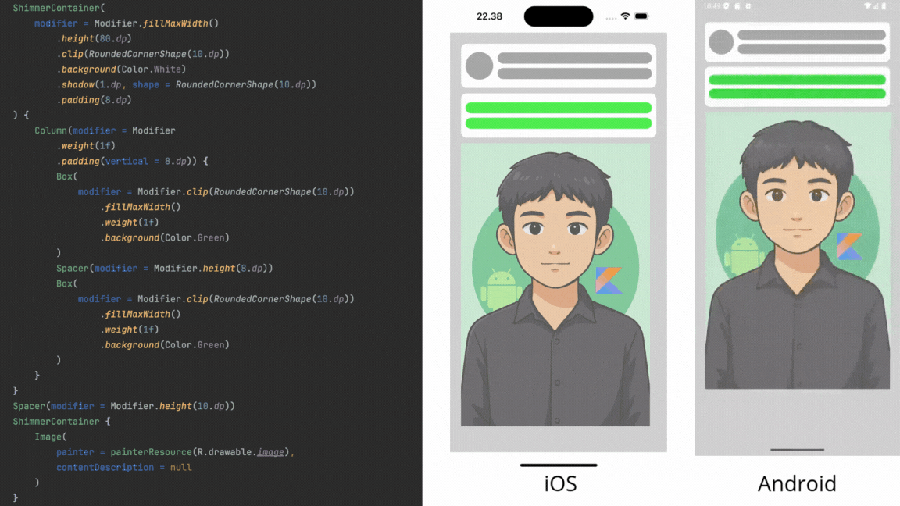
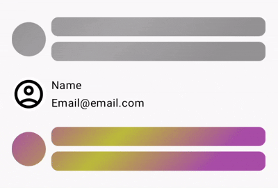

# KMP-Shimmer-Compose

ShimmerContainer is a composable in Jetpack Compose that wraps any content and automatically applies a shimmer animation to it until your content is "loaded".



## Usage

Add the dependency to your `build.gradle.kts` file:

```kotlin
implementation("io.github.suwasto:kmp-shimmer-compose:$version")
```

To use the shimmer effect, simply wrap your composable content with the `ShimmerContainer`. The shimmer effect is active by default (`isLoading = true`). You can pass a `modifier` to customize its appearance or behavior.

```kotlin
ShimmerContainer(
    modifier = Modifier.fillMaxWidth(),
    isLoading = true
) {
    // Your content here
}
```

The `isLoading` parameter in `ShimmerContainer` defaults to the value provided by `LocalShimmerLoading`, which is `true` by default.

### Centralized Loading Control with `ShimmerSurface`

You can use the `ShimmerSurface` composable to control the loading state of multiple `ShimmerContainer`s within a single parent. By setting the `isLoading` parameter on the `ShimmerSurface` (which defaults to `true`), all nested `ShimmerContainer`s will inherit this loading state. `ShimmerSurface` also accepts a `modifier`.

```kotlin
ShimmerSurface(
    modifier = Modifier.padding(16.dp),
    isLoading = true
) {
    // Multiple ShimmerContainers can be placed here
    // They will inherit isLoading from ShimmerSurface
    ShimmerContainer {
        // This will have the shimmer effect
    }
    ShimmerContainer {
        // This will also have the shimmer effect
    }
}
```

## Customization

You can customize the shimmer animation by providing a custom `ShimmerTheme` using `LocalShimmerTheme`.

```kotlin
val customShimmerTheme = ShimmerTheme(
    backgroundColor = Color.Gray.copy(alpha = 0.5f),
    shimmerColor = Color.White,
    durationMillis = 1500
)

CompositionLocalProvider(LocalShimmerTheme provides customShimmerTheme) {
    ShimmerContainer(isLoading = true) {
        // Your content with the custom shimmer theme
    }
}
```

### Theme Customization with `ProvideShimmerTheme`

For more convenient theme customization, especially for handling light and dark modes, you can use the `ProvideShimmerTheme` composable. This function allows you to specify different shimmer and background colors for both light and dark themes.

```kotlin
ProvideShimmerTheme(
    lightShimmerColor = Color.White.copy(alpha = 0.5f),
    lightBackgroundColor = Color.Gray.copy(alpha = 0.5f),
    darkShimmerColor = Color.White.copy(alpha = 0.3f),
    darkBackgroundColor = Color.DarkGray.copy(alpha = 0.3f),
    durationMillis = 1800
) {
    // ShimmerContainers inside this block will use the provided theme
    ShimmerContainer {
        // Your content
    }
}
```

### `ShimmerTheme` Parameters

*   `backgroundColor`: The background color of the shimmer area.
*   `shimmerColor`: The color of the shimmer highlight.
*   `durationMillis`: The duration of one shimmer animation cycle in milliseconds.

## Example

### Basic Usage
Here is a basic example of a `ShimmerContainer` with a placeholder layout for a list item.

```kotlin
ShimmerContainer(
    modifier = Modifier
        .fillMaxWidth()
        .height(80.dp)
        .shadow(1.dp, shape = RoundedCornerShape(10.dp))
        .clip(RoundedCornerShape(10.dp))
        .background(Color.White)
        .padding(8.dp)
) {
    Row(
        modifier = Modifier.fillMaxWidth(),
        verticalAlignment = Alignment.CenterVertically
    ) {
        Box(
            modifier = Modifier
                .clip(CircleShape)
                .size(50.dp)
                .background(Color.Gray)
        )
        Spacer(modifier = Modifier.width(8.dp))
        Column(
            modifier = Modifier
                .weight(1f)
                .padding(vertical = 8.dp)
        ) {
            Box(
                modifier = Modifier
                    .clip(RoundedCornerShape(10.dp))
                    .fillMaxWidth()
                    .weight(1f)
                    .background(Color.Gray)
            )
            Spacer(modifier = Modifier.height(8.dp))
            Box(
                modifier = Modifier
                    .clip(RoundedCornerShape(10.dp))
                    .fillMaxWidth()
                    .weight(1f)
                    .background(Color.Gray)
            )
        }
    }
}
```


### Custom Theme
You can customize the shimmer effect by providing a custom `ShimmerTheme`.

```kotlin
CompositionLocalProvider(LocalShimmerTheme provides ShimmerTheme(
    shimmerColor = Color.Yellow.copy(alpha = 0.5f),
    backgroundColor = Color.Magenta.copy(alpha = 0.35f),
    durationMillis = 1400
)) {
    ShimmerContainer(
        modifier = Modifier
            .fillMaxWidth()
            .height(80.dp)
            .shadow(1.dp, shape = RoundedCornerShape(10.dp))
            .clip(RoundedCornerShape(10.dp))
            .background(Color.White)
            .padding(8.dp)
    ) {
        // The same content as the basic example
    }
}
```


### Centralized Control with `ShimmerSurface`
For more complex scenarios, you can use `ShimmerSurface` to control the loading state for multiple shimmer containers at once. Instead of handling `isLoading` for each `ShimmerContainer`, you can wrap them in a `ShimmerSurface` to control the loading state from a single source.

```kotlin
var isLoading by remember { mutableStateOf(true) }

ShimmerSurface(isLoading = isLoading) {
    // This shimmer inheriting the loading state.
    ShimmerContainer() {
        ShimmerContent()
    }
    // this content is not shimmering, not wrapped inside ShimmerContainer
    NoShimmerContent()
    CompositionLocalProvider(LocalShimmerTheme provides ShimmerThemeValues(
        shimmerColor = Color.Yellow.copy(alpha = 0.5f),
        backgroundColor = Color.Magenta.copy(alpha = 0.35f),
        durationMillis = 1400
    )) {
        // This will also shimmer, inheriting the loading state. and custom theme
        ShimmerContainer {
            ShimmerContent()
        }
    }
}
```



**Note:** The `ShimmerContainer` applies its effect to all non-transparent areas within its content. Any composable with a solid background will be affected by the shimmer.

## License

```
Copyright 2025 Suwasto

Licensed under the Apache License, Version 2.0 (the "License");
you may not use this file except in compliance with the License.
You may obtain a copy of the License at

    http://www.apache.org/licenses/LICENSE-2.0

Unless required by applicable law or agreed to in writing, software
distributed under the License is distributed on an "AS IS" BASIS,
WITHOUT WARRANTIES OR CONDITIONS OF ANY KIND, either express or implied.
See the License for the specific language governing permissions and
limitations under the License.
```
